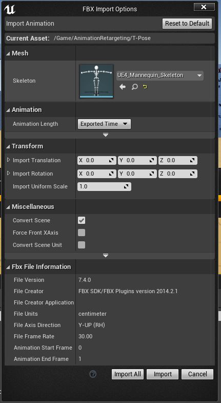

Inspiration: https://www.youtube.com/watch?v=Wnnp8rh20R8

# Retargeting

## Why do we even need to perform the steps outlined herein?

- A-Pose vs. T-Pose
- Root (UE4) and Rootless (Mixamo) models and animation corruption because of these differences

## Prerequisites

- Blender (used v2.90.1)
- Unreal Engine 4 (used v.4.25.3)
- *Mixamo converter* Addon for Blender (free)

### Required Steps

- [ ] Import UE4 Mannequin

# Setup

## Export UE4 Mannequin as FBX
1. Inside UE4 add the *Third Person* Blueprint Feature to your project

2. Open the *SK_Mannequin* Skeletal Mesh

3. Export Asset

## Export UE4 Mannequin to mixamo.com and import with T-Pose
1. Open www.mixamo.com
2. Upload the exported UE4 Mannequin 

3. Search for and select the *T-Pose* animation on mixamo.com

4. Download the animation with the following *DOWNLOAD SETTINGS*

## Apply T-Pose to UE4 Mannequin
1. Import *T-Pose.fbx* into UE4

Your preview should then look something like this (open the imported file inside UE4):

## Download Character from mixamo.com

1. Choose *EXO GRAY* as the character (you may want to refresh mixamo.com to minimize bugs)
2. Download the character with the *T-Pose* animation

and these *DOWNLOAD SETTINGS*:

## The rest...

1. Create a folder called *converted* (a subfolder is required by the *Mixamo Converter* Blender plugin)
That will be the **Output folder** for the *Mixamo Rootbaker*
Right now my folder looks like this:

2. Set the **Input folder**:

2. Set the **Output folder** to *converted* (or whatever you named your output folder)

Note: Do not select any files while setting these folders.

3. Use these settings for conversion"

4. Click the *Batch Convert* button

The converted model will have a root bone and will have the UE4 skeleton naming conventions.

5. Import the model into UE4 with the following settings

6. Open *Exo-Gray-In-T-Pose_Skeleton* in UE4
7. Make sure to enable *Show Retargeting Options* like so:

8. Right-Click the *root* bone inside the *Skeleton Tree* view and click on *Recusrively Set Translation Retargeting Skeleton*

9. Set the Translation Retargeting property of *root* and *Pelvis* from ***Skeleton*** to ***Animation Scaled*** (this time use left-click)

10. Repeat step 8 for *UE4_Mannequin_Skeleton* (**Do Not** repeat Step 9 for the *UE4_Mannequin_Skeleton*)
11. Set the *Preview Mesh*

Don't forget to *Apply To Asset*

12.  While having *UE4_Mannequin_Skeleton* open, Set *Preview Animation* to *T-Pose*

13. Activate the *Retarget Manager* window,

choose the *Humanoid* rig

and click on *Modify Pose* -> Use *CurrentPose*

14. Repeat Step 13 for *Exo-Gray-In-T-Pose_Skeleton*

## Retarget Animations from any UE4 rigged skeleton to your Mixamo character

Now we have completed the setup required to do this. Let's say you would want to retarget (meaning **transfer** something from one to the other i.e. make animations target a new skeleton) animations from ALS (Advanced Locomotion System) to your imported Mixamo character.

To do this follow these steps:

Note: You can also just retarget single animations but if you can get your hands on an *Animation Blueprint* then you can export all therein referenced animations at once!

### Retarget animations via an existing Animation Blueprint

As an example I will take the *Animation Blueprint* for the character from *ALS*. But I could have also chosen to retarget animations from the [*Animation Starter Pack*](https://www.unrealengine.com/marketplace/en-US/product/animation-starter-pack) provided by Epic Games for free on the Marketplace.

1. Locate the **AnimBP**, right-click and choose **Retarget Anim Blueprints**

2. Select your target skeleton and click on *Retarget*

Done!

### Add additional animations from mixamo.com
The approach described here is also viable for importing animations from places other than mixamo.com

1. Download an animation from mixamo.com (without a skin!)
2. Open Blender and use Mixamo Rootbaker with previous settings to batch convert all new animations with UE4 suitable configurations (change the input and output folder if need be)
3. Drag and Drop the newly converted animations into UE4
4. Import with following settings (note how I have selected the skeleton of the mixamo character. In short, select the skeleton you want the animations to bind to)

Done!